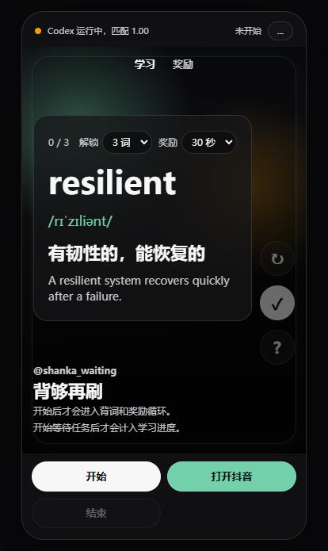

# Shanka Waiting Deck

Shanka is a Windows MVP for turning Codex Desktop wait time into a short-video-style learning loop.

When Codex is busy, Shanka can show an always-on-top phone-shaped window near Codex. You review a few vocabulary cards, unlock a timed Douyin reward, then Shanka pulls focus back when the reward timer ends.

## Screenshots





See `docs/MVP.md` for the delivery checklist.
See `docs/USER_GUIDE.md` for step-by-step usage.

## Install

```bash
npm install
python -m pip install -r requirements.txt
```

If Electron download times out, install with a mirror in PowerShell:

```powershell
$env:ELECTRON_MIRROR='https://npmmirror.com/mirrors/electron/'
npm install
```

## First Run

Put Codex into a busy/running state, then capture the busy indicator:

```bash
npm run capture:codex
```

Select a stable Stop/loading area in the screenshot and press Enter.
If you do not select a region, Shanka saves the full Codex window as a fallback template. Region selection is more accurate, but the fallback lets first-run setup continue.

Then run the full mode:

```bash
npm run codex:mode
```

If no template exists, `codex:mode` will ask you to capture one first.

Windows users can also double-click:

```text
scripts/install.cmd
scripts/capture_codex_template.cmd
scripts/start_codex_mode.cmd
scripts/doctor.cmd
```

## Commands

```bash
npm start          # Start the Electron learning window
npm run watch:codex
npm run codex:mode
npm run doctor
npm test
```

## Current Behavior

- Vocabulary data lives in `data/vocabulary.json`.
- Tech cards live in `data/tech_cards.json`.
- Content mode can be vocabulary, tech cards, or mixed.
- The window starts idle and can be controlled manually or by the Codex watcher.
- When Codex stops being busy, Shanka hides and brings Codex back to the foreground.
- `Ctrl+Shift+S` brings the hidden window back.
- Unlock threshold: 2 / 3 / 5 cards.
- Reward timer: 15 / 30 / 60 seconds.
- Reward URL can be changed from the in-app settings sheet.
- Settings persist in Electron user data.
- Douyin reward opens `https://www.douyin.com` in the external browser.
- Mouse wheel down, `ArrowDown`, or `j` advances the feed.

## Local Control API

Electron listens on `127.0.0.1:39473`:

```bash
curl -X POST http://127.0.0.1:39473/task/start
curl -X POST http://127.0.0.1:39473/task/pause
curl -X POST http://127.0.0.1:39473/task/resume
curl -X POST http://127.0.0.1:39473/task/end
```

Python helper:

```bash
python scripts/task_control.py start
python scripts/task_control.py end
```

## Troubleshooting

Run:

```bash
npm run doctor
```

It checks Python modules, the busy template, Codex windows, and the Electron control server.
